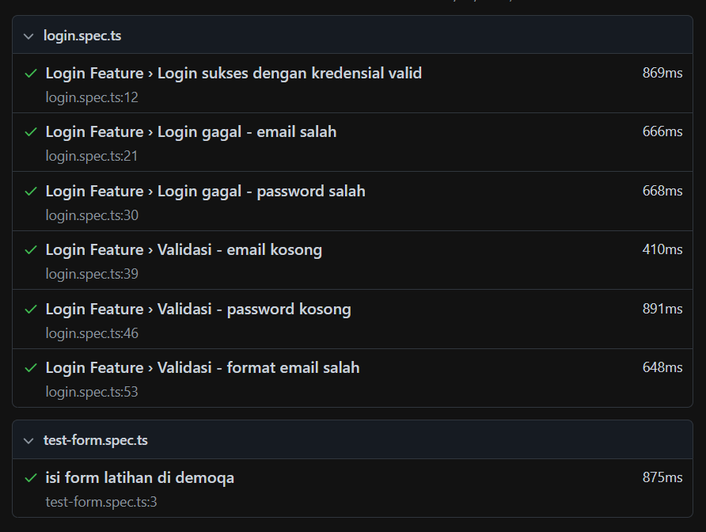

# Playwright Automation Portfolio - Gagas Langgeng Dwi Prastyo

This repository showcases my learning journey and projects in **Playwright Automation Testing**.  
It includes various test scenarios, Page Object Model (POM) implementations, API validations, CI/CD pipeline integrations, and automated reporting.

🔗 **Live Portfolio Link:** [Playwright Automation Portfolio](https://github.com/Gagasldp/playwright-automation-portfolio)

---

## 📌 Objectives
- Practice and improve automation testing skills using Playwright.
- Apply best practices in structuring test scripts with POM.
- Integrate Playwright automation into CI/CD workflows.
- Generate professional test execution reports.

---

## 📂 Repository Structure
/docs → Documentation and test results
/pages → Page Object Model classes
/tests → Playwright test scripts
/playwright.config.ts → Playwright configuration file
/package.json → Project dependencies and scripts

---

## 🚀 Topics Covered
1. **Basic Web UI Testing** – Writing and running automated test cases for login and form validation.
2. **Page Object Model (POM)** – Organizing locators and actions in reusable classes.
3. **UI Assertions** – Verifying element visibility, text content, and URL changes.
4. **API Assertions** – Testing API responses directly in Playwright.
5. **CI/CD Integration** – Running tests automatically in GitHub Actions.
6. **Automated Test Reports** – Generating HTML and JUnit reports after execution.

---

## 🛠 Tools & Technologies
- [Playwright](https://playwright.dev/)
- Node.js
- GitHub Actions (CI/CD)
- Postman & Thunder Client
- VSCode
- GitHub Desktop

---

## 📸 Sample Test Execution

---

## 📬 Contact
**Gagas Langgeng Dwi Prastyo**  
📧 Email: gagasldp99@gmail.com  
🔗 LinkedIn: [Gagas Langgeng Dwi Prastyo](https://www.linkedin.com/in/gagas-langgeng-dwi-prastyo-953713238/)  
📂 Portfolio: [Playwright Automation Portfolio](https://github.com/USERNAME/playwright-automation-portfolio)
